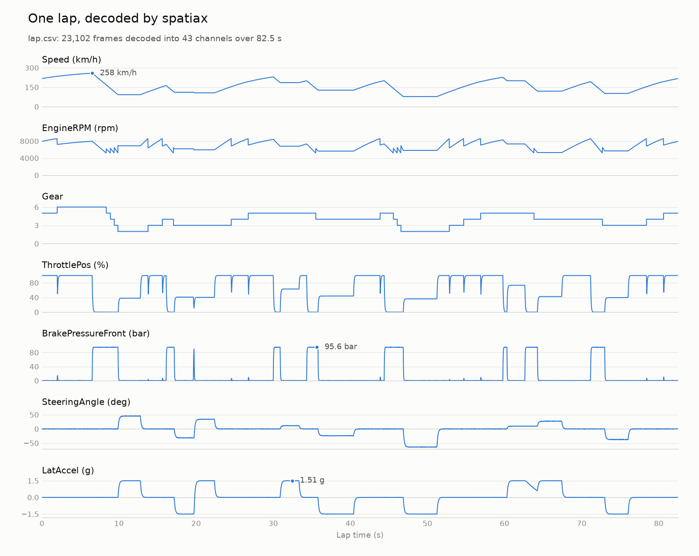

# SpatiaX

A CAN bus / DBC decoder for motorsport telemetry, written in Rust.

- **What it does** — raw CAN frames plus a DBC in, engineering values out.
  Both byte orders, signed and unsigned, multiplexing, value tables, CAN FD
  to 64 bytes. Reads `candump` logs, captures live off a SocketCAN
  interface, and exports a MoTeC `.ld` file that i2 opens.
- **Why it exists** — the previous version of this repository had three
  decoder bugs that produced plausible-looking traces rather than crashing.
  In telemetry that is the expensive kind of wrong: an engineer chases a
  problem that does not exist, and it costs a session.
  [The full story](#why-the-rewrite).
- **What backs it** — 500,000 decoded values checked against `cantools` on
  every CI push, reference vectors computed by hand, and property tests
  over every signal layout from 1 to 64 bits. An exported lap is read back
  by an independent `.ld` implementation and opens in MoTeC i2 Pro.
- **See it work** — [one lap, decoded and plotted](#see-it-on-a-lap), in
  three commands.

The point of this project is not that it decodes CAN — `cantools` already
does that, and does it well. The point is that it decodes CAN **and ships
the evidence that it does so correctly**: hand-computed reference vectors,
exhaustive property tests, and a differential harness that checks every
decode against the reference implementation the industry already trusts.

> **Status: v0.1 — working, and every claim is backed by a named test.**
> The DBC parser, decoder, encoder, `candump` replay, live SocketCAN
> capture, MoTeC `.ld` export, and the `spatiax` command-line tool are
> implemented and exercised by CI on every push. An exported lap was opened
> in **MoTeC i2 Pro 1.1 on 2026-09-03**: i2 derived the session, wrote its
> own `.ldx`, and plotted the channels as the log has them. Correctness is
> checked three independent ways — reference vectors computed by hand,
> property tests over every signal layout from 1 to 64 bits, and a
> differential harness that decodes **500,000 generated cases against
> `cantools` per CI run**.
>
> Known limits, stated plainly: extended multiplexing (`m<N>M` /
> `SG_MUL_VAL_`) is *rejected at parse time* rather than decoded, the demo
> lap is synthetic rather than a real logged session, and the benchmark
> figures come from a single laptop. Nothing here is claimed as working
> unless [Current state](#current-state) names the test that proves it —
> or [see it on a lap](#see-it-on-a-lap) first.

---

## See it on a lap

One lap of a GT3-style car — 23,102 CAN frames in a `candump` log — decoded
in under a tenth of a second on a laptop, then plotted:

<picture>
  <source media="(prefers-color-scheme: dark)" srcset="docs/demo/lap-dark.png">
  
</picture>

This is the terminal session behind it — the database is checked, the log
is decoded to the screen, then to CSV, then the CSV is plotted:


To do the same on your machine:

```bash
cargo install --path .
pip install matplotlib

spatiax check fixtures/demo/gt3.dbc
spatiax decode --format csv fixtures/demo/gt3.dbc fixtures/demo/synthetic_lap.log > lap.csv
python3 scripts/plot_lap.py lap.csv -o lap.png
```

The same three commands work on your own DBC and `candump` log. The CSV has
one row per decoded signal — timestamp, message, signal, raw and physical
value, unit, label — so it opens in Excel and imports into MoTeC i2 or
ATLAS like any other CSV. `plot_lap.py` plots whichever channels you name
(`--channels Speed,LatAccel`), one panel each on a shared lap-time axis.

**The lap is synthetic.** No real car's data is in this repository.
`scripts/synthetic_lap.py` drives a simple car model round a fictional
3.6 km circuit, encodes what its sensors would report with the reference
implementation (`cantools`), and writes the frames the way `candump` would
have logged them; `fixtures/demo/gt3.dbc` is the database it encodes
against. That makes the demo a round trip through the other decoder, and
CI regenerates the log on every push to confirm it still matches. If you
have a real log you can share, the commands above and the plot script apply
unchanged — the channel names are just arguments.

## Why this exists

Every car on a GT3, GT4, LMP, or single-seater grid runs CAN. Turning raw
frames into engineering values — RPM, damper positions, brake temperatures,
wheel speeds — is the first link in every telemetry chain, and it is a link
teams maintain in-house. It is also a link where being *subtly* wrong is
worse than being obviously broken: a decoder that silently misreads a
big-endian signal produces plausible-looking traces that send an engineer
chasing a problem that does not exist.

So correctness is the product. The design follows from that.

## Design

These are the decisions the rebuild is built on. Where a decision describes
behaviour, the [status table](#current-state) governs whether that behaviour
has actually landed and is tested.

**Bit extraction is isolated and tiny.** `src/decode.rs` contains no I/O, no
allocation, and no knowledge of DBC text — just the arithmetic that pulls a
signal out of a payload. Keeping it small is what makes it possible to test
exhaustively.

**Extraction is one load, one shift, one mask.** Any signal that fits in
eight bytes sits inside some 8-byte window of the payload, so the decoder
loads that window as a `u64` — little-endian for Intel, big-endian for
Motorola — and shifts the signal down. The bit-by-bit walk survives for the
one shape a single word cannot hold (58 bits or more from an unaligned
start, spanning nine bytes) and as the independent formulation the fast
path is checked against for every layout on every payload length.

**Frames don't allocate.** CAN FD bounds a payload at 64 bytes, so a frame
is a fixed `[u8; 64]` plus a length rather than a `Vec`. `CanFrame` is
`Copy`, and the decode path performs no heap allocation.

**The extended-identifier flag has exactly one interpretation site.** DBC
marks a 29-bit identifier by setting bit 31 of the message ID. That is
handled in `CanId::from_dbc` and nowhere else — a rule that exists because
the previous iteration of this code got it wrong in one place and then
rejected its own output in another.

**One runtime dependency for the library.** `thiserror`. Parsing a DBC is
line-oriented text handling and decoding is integer shifts; both are the
substance of the project rather than something to outsource. The `spatiax`
binary adds `clap`, behind the default-on `cli` feature; a crate that only
wants the decoder turns it off with `default-features = false`.

## Using it

```bash
cargo install --path .

spatiax decode car.dbc session.log                # text, grouped by frame
spatiax decode car.dbc session.log --format csv   # one row per signal
candump -L can0 | spatiax decode car.dbc -        # from a pipe
spatiax check car.dbc                             # layout problems
spatiax export car.dbc session.log -o session.ld  # for MoTeC i2

cargo install --path . --features socketcan       # Linux only
spatiax live car.dbc can0                         # decode as frames arrive
spatiax live car.dbc can0 --timeout 5             # ...and stop after 5s of silence
```

`decode` reads the format `candump -l` writes. Frames the DBC does not
describe are counted rather than printed; a malformed log line is reported
on stderr with its line number and reading carries on. `live` does the same
for frames arriving on a SocketCAN interface, stamped with the kernel's
receive time — the clock `candump` logs — so a live decode and a later
replay of the same session agree. It otherwise runs until interrupted;
`--timeout` ends it once the bus has been quiet for that many seconds, which
is what a car being switched off looks like from the pit wall. The text form
looks like this:

```text
1700000000.000500 300 SuspensionData
  DamperMux: Front right (1)
  DamperPosFR: 1.6 mm
1700000000.001000 18FEEE00 DiagResponse
  ResponseCode: Overheat (1)
```

Values are printed at the precision their signal's factor and offset
imply — a signal scaled by 0.01 prints `652.8`, not the `652.8000000000001`
that binary floating point would otherwise show — in both the text and
CSV forms.

A frame line carries a `[dlc 9]` suffix when the log gave it a data length
code above the eight bytes it holds. Classic CAN allows the codes 9 to 15 on
a full frame, `candump` writes one as a `_9` suffix, and an ECU can mean
something by which it sent, so the code is kept rather than inferred back
from the payload.

`check` reports the two layout problems `cantools` refuses to load in strict
mode — a signal that runs past its message's DLC, and two signals that can
decode together but share a bit — since the parser here is lenient and
would otherwise decode such a file quietly.

`export` writes the decoded log as a MoTeC `.ld` file, which i2 opens
directly:

```console
$ spatiax export car.dbc session.log --output session.ld
spatiax: session.ld — 43 channels at 50 Hz, 4126 samples each, from 23102 frames
```

A `.ld` channel is a fixed-rate array with no per-sample timestamp, so the
irregular arrival of CAN frames has to be resampled onto one grid. Without
`--rate` the grid is the first standard rate at or above the fastest message
in the log, so nothing is sampled below the rate it arrives at. Between
updates the last value is held rather than interpolated: the trace steps
where the bus stepped, and no sample is a value some ECU never sent.
`--driver`, `--vehicle`, `--venue` and `--event` fill in the session
metadata i2 displays, none of which a DBC or a log carries.

Exit status follows `grep`: 0 when nothing was wrong, 1 when the command
finished but found something (malformed lines, layout problems), 2 when it
could not run.

## Correctness strategy

Three layers, in increasing order of what they catch:

1. **Hand-computed reference vectors.** A small set of signals whose
   expected raw and physical values were worked out on paper from the DBC
   definition and the payload bytes. These are the only expectations in the
   project not produced by a machine, which is exactly why they come first.
   A decoder cannot pass these by being self-consistently wrong.
2. **Property tests.** `tests/properties.rs` runs `proptest` over random
   start bits, every width from 1 to 64, both byte orders, and both value
   types inside a 64-byte payload: insert-then-extract round-trips,
   insertion never touches a bit outside the signal, `required_bytes` is
   exactly the span touched, and extraction agrees with an oracle written
   from a different formulation of the bit-numbering rule. Signals
   straddling byte boundaries — where hand-written vectors run out of
   imagination — are the common case here, not the edge case.
3. **Differential testing against `cantools`.** `tests/differential.rs`
   generates random but valid DBCs (standard and extended identifiers,
   payloads from 1 to 64 bytes, non-overlapping Intel and Motorola signals,
   signed and unsigned, assorted scalings, multiplexed pages, value tables)
   and random frames, decodes them with both `spatiax` and the Python
   reference, and requires exact agreement on raw values, on which signals
   are present, and on labels, with float-noise agreement on physical
   values. Re-encoding the raw values must also reproduce the bytes
   `cantools` produces. The test refuses to pass with fewer than 100,000
   decoded signal values; CI runs 500,000 and fails if the oracle is
   missing.

Layer 3 is the differentiator. `cantools` is what motorsport data engineers
already reach for, so agreement with it is a claim anyone can evaluate in
about thirty seconds:

```bash
python3 -m venv .venv && .venv/bin/pip install cantools==43.0.2
cargo test --test differential -- --nocapture
```

The test finds `.venv/bin/python` on its own, or honours
`SPATIAX_ORACLE_PYTHON`. Every run prints its seed; `SPATIAX_DIFFERENTIAL_SEED`
replays one, and a failure leaves the generated files under
`target/differential/<seed>/`.

The `.ld` exporter is held to the same standard by a second oracle, since a
format nobody documented is only written correctly if something nobody here
wrote can read it back:

```bash
bash scripts/fetch_ld_oracle.sh
cargo test --test ld -- --nocapture
```

`SPATIAX_REQUIRE_LDPARSER=1` turns a missing reader from a skip into a
failure, which is what CI sets.

## Current state

Honest accounting. A row is only "done" when there is a test named for it
and CI runs that test.

| Capability | State |
|---|---|
| CAN frame and identifier types | Done — `frame::tests`, `tests/public_api.rs` |
| DBC extended-identifier handling | Done — `dbc_id_with_bit31_set_is_extended_and_strips_the_flag` |
| DBC parser (`BO_` / `SG_` / `VAL_` records) | Done — `dbc::parser::tests`, `fixture_parses_all_messages_and_signals` |
| Bit extraction, Intel byte order | Done — `vector_a_intel_word_is_little_endian` |
| Bit extraction, Motorola byte order | Done — `vector_b_motorola_word_is_big_endian`, `vector_c`, `vector_f` |
| Signed signals, factor/offset scaling | Done — `vector_d_signed_signal_sign_extends_from_its_own_width`, `vector_e` |
| Reference vector suite | Done — `tests/vectors.rs`, expected values computed by hand |
| Signal encoder (`insert_raw`, `encode_signal`) | Done — `encode::tests`, `insert_then_extract_returns_the_raw_value`, re-encoding checked against `cantools` |
| 64-byte (CAN FD) payloads | Done — every layout up to 64 bytes in `tests/properties.rs` and `tests/differential.rs` |
| Property tests | Done — `tests/properties.rs`, 10 properties, 2,048 cases each locally and 16,384 in CI |
| Differential test vs. `cantools` | Done — `tests/differential.rs`, ≥100,000 generated cases enforced, 500,000 in CI |
| Multiplexed signals (simple multiplexing) | Done — `the_multiplexor_value_selects_which_page_decodes`, `vector_g`, multiplexed messages in `tests/differential.rs` |
| Extended multiplexing (`m<N>M`, `SG_MUL_VAL_` ranges) | Rejected at parse time with a clear error, rather than decoded wrongly |
| Value tables (`VAL_`, `Decoded::label`) | Done — `parses_value_tables_onto_their_signal`, `labels_match_the_sign_interpreted_raw_value`, labels compared in `tests/differential.rs` (≥10,000 enforced) |
| CAN FD frame I/O | Done — FD frames read from `candump` logs (`reads_a_can_fd_frame_and_drops_its_flags_digit`) and from SocketCAN (`an_fd_frame_with_an_extended_identifier_carries_all_its_bytes`, `tests/live.rs`) |
| Data length codes | Done — the CAN FD sizes and the classic `len8_dlc` quirk both map (`every_data_length_code_maps_to_the_length_can_fd_gives_it`, `keeps_the_data_length_code_of_a_len8_dlc_frame`, `rejects_a_can_fd_payload_of_a_length_no_code_can_express`) |
| `candump` log replay (`candump::LogReader`) | Done — `candump::tests`, `tests/candump.rs` replays `fixtures/gt3_sample.log` |
| DBC layout check (`dbc::check`) | Done — `dbc::check::tests` |
| `spatiax` binary (`decode`, `check`) | Done — `tests/cli.rs` runs the built binary end to end |
| SocketCAN live capture (`live::Capture`, `spatiax live`) | Done — `live::tests`, `tests/live.rs` sends frames over `vcan0` in CI and reads them back through both |
| Read timeout on a live capture | Done — `a_capture_with_a_read_timeout_stops_waiting_once_the_bus_goes_quiet`, `the_live_command_exits_cleanly_once_the_bus_has_been_quiet_for_the_timeout` |
| Benchmarks | Done — `benches/decode.rs`; the `benchmarks` job in CI runs them on every push and prints the table in its summary |
| Demo lap (`fixtures/demo`, synthetic) | Done — `tests/demo_lap.rs` decodes every frame and checks the channels still read like a lap; CI regenerates the log with `scripts/synthetic_lap.py --check` |
| MoTeC `.ld` export (`ld`, `spatiax export`) | Done — `tests/ld.rs`; in the `ld export vs ldparser` CI job `ldparser` reads back all 70,993 values of the exported demo lap, and its own writer reproduces `fixtures/gt3_sample.ld` byte for byte |
| The exported file opened in MoTeC i2 | Confirmed 2026-09-03, i2 Pro 1.1 — opens the file, derives a 1:22.520 session from the sample count and rate in the channel headers (4126 / 50 Hz), writes its own `.ldx`, and plots `EngineRPM` peaking at 8600 rpm and `Speed` at 258 km/h as the log has them |

## Performance

The table below is the output of `scripts/bench_table.py` after
`cargo bench` on the machine named in its first line. That is the only way
a figure gets into this README: the script reads what criterion measured,
and the `benchmarks` job in CI runs the same benches on every push and
prints its own table in the job summary, so a GitHub-hosted runner can be
compared against the figures here. The previous version of this README
carried a throughput table for a workspace that had never compiled;
removing it was the first task of the rebuild, and this section is what
replaces it.

WSL2 on a laptop is not a quiet machine. An earlier run on the same day,
with the CPU clocked down, came in 2.5× slower on every row including the
text parsing; two quiet runs agreed within 10%, and this is the second.
Treat these as indicative and re-run them on your own hardware.

Measured on AMD Ryzen 5 5625U with Radeon Graphics (8 threads), Linux 6.6.87.2-microsoft-standard-WSL2, rustc 1.97.1 (8bab26f4f 2026-07-14), 2026-09-03.

| Benchmark | Mean per iteration (95% CI) | Per unit | Rate |
|---|---|---|---|
| `decode_frame/gt3_sample` · 7 frames | 273.3 ns (269.8 ns – 278.0 ns) | 39.0 ns / frame | 25.6 M frames/s |
| `decode_message/EngineData` · 4 signals | 21.7 ns (21.6 ns – 21.9 ns) | 5.4 ns / signal | 184.0 M signals/s |
| `decode_message/WheelSpeeds` · 2 signals | 14.4 ns (14.1 ns – 14.8 ns) | 7.2 ns / signal | 138.9 M signals/s |
| `decode_message/SuspensionData` · 2 signals | 16.9 ns (16.6 ns – 17.2 ns) | 8.4 ns / signal | 118.7 M signals/s |
| `extract_raw/intel/1_bit` | 3.8 ns (3.8 ns – 3.9 ns) | 3.8 ns / signal | 259.8 M signals/s |
| `extract_raw/intel/16_aligned` | 4.1 ns (4.1 ns – 4.2 ns) | 4.1 ns / signal | 242.5 M signals/s |
| `extract_raw/intel/12_unaligned` | 3.7 ns (3.6 ns – 3.7 ns) | 3.7 ns / signal | 273.2 M signals/s |
| `extract_raw/intel/64` | 3.6 ns (3.6 ns – 3.7 ns) | 3.6 ns / signal | 276.8 M signals/s |
| `extract_raw/motorola/16_aligned` | 4.7 ns (4.6 ns – 4.7 ns) | 4.7 ns / signal | 214.0 M signals/s |
| `extract_raw/motorola/8_unaligned` | 4.8 ns (4.7 ns – 4.9 ns) | 4.8 ns / signal | 209.1 M signals/s |
| `extract_raw/motorola/64` | 4.7 ns (4.6 ns – 4.8 ns) | 4.7 ns / signal | 212.9 M signals/s |
| `extract_raw/intel/64_over_9_bytes` | 65.0 ns (63.5 ns – 66.7 ns) | 65.0 ns / signal | 15.4 M signals/s |
| `extract_raw/motorola/64_over_9_bytes` | 80.7 ns (79.6 ns – 81.9 ns) | 80.7 ns / signal | 12.4 M signals/s |
| `candump/classic` | 197.0 ns (195.9 ns – 198.1 ns) | 197.0 ns / line | 5.1 M lines/s |
| `candump/fd` | 212.6 ns (210.6 ns – 214.8 ns) | 212.6 ns / line | 4.7 M lines/s |

What each row measures:

- `decode_frame/gt3_sample` — `Database::decode_frame` over the seven data
  frames in `fixtures/gt3_sample.log`, taken as-is. That mix includes an
  identifier the DBC does not describe, a one-byte diagnostic frame, and a
  truncated frame whose three missing signals each produce an error, so it
  is closer to a bad day on the bus than to a clean stream.
- `decode_message/*` — `Message::decode` on each fixture message with a full
  payload, including sign interpretation, scaling, and multiplexor
  selection. This is the per-signal cost a caller sees.
- `extract_raw/*` — the bit extraction alone, by layout. Width no longer
  matters; byte order costs one `bswap`. The `_over_9_bytes` rows are the
  shape a single word load cannot cover — 58 bits or more from an unaligned
  start — which falls back to the bit walk.
- `candump/*` — parsing one log line into a frame, which is where
  `spatiax decode` actually spends its time.

## Roadmap

In order, each building on the one before:

- **Salvage.** Collapse six crates to one, delete the subsystems that were
  breadth rather than depth, restore a green build, and strip every unearned
  claim.
- **The decoder.** DBC parsing and bit-exact extraction for both byte
  orders, against hand-computed vectors.
- **Proof.** Property tests and the differential harness, both enforced in
  CI.
- **Real-world coverage.** Multiplexed signals, CAN FD, value tables,
  SocketCAN capture, and `candump` replay.
- **Performance.** Byte-aligned fast paths, benchmarks, and the first
  numbers this project is willing to publish.
- **MoTeC `.ld` export.** The decoded log written as a file i2 reads,
  checked against an independent reader and a golden file.

## MoTeC `.ld` export

MoTeC i2 is the de facto analysis tool on GT3, GT4, LMP, and most
single-seater grids; engineers work inside it for the whole of a session. A
tool that emits `.ld` slots into a workflow that already exists instead of
asking anyone to adopt a new viewer — "decode your CAN log, open it in i2"
is a complete and useful sentence, in a way that "decode your log and then
look at my custom dashboard" is not.

It is also the part of this project that cannot be faked. The format is
binary and undocumented by MoTeC; what exists is a community
reverse-engineering effort, and the layout here was rebuilt from it and then
checked field by field.

**How far the evidence goes, precisely.** Two checks against
[`ldparser`](https://github.com/gotzl/ldparser) — an independently
reverse-engineered implementation, pinned by commit and checksum, never
vendored into this MIT tree because it is GPL-3.0 — plus a byte-level golden
file, all three in CI on every push:

- **Read back.** Every value of an exported lap — 70,993 of them across 43
  channels — is decoded by `ldparser` and compared bit for bit with what
  this crate meant to write. That covers every field a reader looks at.
- **Written again.** The golden file is pulled through `ldparser`'s own
  writer and the result compared byte for byte with ours. All 4,276 bytes
  match. This is the check that covers what the first one cannot: the device
  identity, the logging magic, the per-channel counter, the calibration
  fields and the padding — everything a reader discards and therefore cannot
  vouch for.

- **Opened in i2.** MoTeC i2 Pro 1.1 opens an exported lap and reports it as
  a 1:22.520 session. That number is `4126 / 50` — the sample count and the
  rate this crate wrote into the channel headers — so i2 is reading those
  fields and agreeing with them. It also generates its own `.ldx` companion
  file for the log, which it does for files it accepts. Plotted in i2,
  `EngineRPM` peaks at 8600 rpm and `Speed` at 258 km/h, matching the source
  log. That is the round trip `plan.md` set as the goal: decode a CAN log,
  open it in i2, read the traces.

One thing to know before opening one, which is not a defect in the file but
will look like one. i2's stock worksheets are wired to MoTeC's standard
channel names — `Engine RPM`, `Ground Speed`, `Throttle Pos` — while this
crate writes the DBC's own signal names. Of the demo lap's 43 channels
exactly one, `Gear`, matches a standard name, so a fresh Circuit workspace
displays that and nothing else until the others are added to a graph by
hand. Every channel is in the file. Renaming them to MoTeC's conventions is
a plausible future flag, and is the one problem here that two independent
implementations agreeing on every byte could never have surfaced.

What the exporter does today: one sample rate for every channel, chosen from
the log unless `--rate` says otherwise; sample-and-hold between updates,
with a channel's first value carried back to the start so no trace begins at
a zero that never happened; `f32` samples with the format's calibration
fields left at identity, so the stored word is the physical value. Left for
later: per-channel sample rates, `int16` channels with per-channel scaling,
and an option to rename channels to MoTeC's standard names so i2's stock
worksheets find them. Writing the `.ldx` companion file is *not* on that
list — i2 generates one itself on opening a log that has none.

Deliberately *not* built instead: a web dashboard, or a bespoke binary log
format. Neither proves anything a motorsport team cares about.

## Why the rewrite

This started as a broad "high-speed telemetry platform" — six crates
covering CAN, serial and network ingestion, signal processing, machine
learning, and alerting. None of it compiled: the workspace listed two member
crates that had never existed, so `cargo metadata` failed before dependency
resolution, and the binary the README told you to run had no package to
build it. There were no tests anywhere in roughly 8,200 lines.

Reading it properly turned up three genuine decoder bugs, all of which a
single test would have caught:

- The DBC parser trimmed each line and then tested whether it started with
  `" SG_ "` — a branch that can never be taken. Every message loaded with
  **zero signals**, and the parser reported success.
- Motorola (big-endian) bit extraction walked bit positions upward, which is
  the Intel rule applied to Motorola data. Roughly half of production
  motorsport DBCs use Motorola layout.
- Extended identifiers were parsed without masking the DBC flag bit, so
  every 29-bit ID came out around 2.1 billion too high — and was then
  rejected by this project's own validator.

The lesson taken from that is the one this rebuild is organised around:
breadth is cheap and proves nothing. One decoder that is provably correct is
worth more than six subsystems that merely look impressive in a file tree.

## Building

```bash
cargo test
```

No system libraries, no ML runtimes, no Docker. The library depends on
`thiserror` alone; the binary adds `clap` behind the `cli` feature, and
`proptest`, `rand`, and `criterion` are dev-dependencies. Requires Rust 1.85
or later. The differential test additionally wants Python 3 with `cantools`
and skips with a message when it cannot find one — see
[Correctness strategy](#correctness-strategy) for the two-line setup.

```bash
cargo bench                        # the benchmarks in benches/decode.rs
python3 scripts/bench_table.py     # their results as the table above
```

The demo lap has its own scripts. Regenerating the log needs `cantools`,
the plot needs `matplotlib`, and the recording needs `asciinema` and `agg`:

```bash
python3 scripts/synthetic_lap.py           # rewrite fixtures/demo/synthetic_lap.log
python3 scripts/synthetic_lap.py --check   # or confirm the committed log still matches
python3 scripts/plot_lap.py lap.csv        # docs/demo/lap.png, --theme dark for the other
scripts/record_demo.sh                     # docs/demo/decode.gif
```

Live capture is behind the `socketcan` feature and only does anything on
Linux, so the default build stays portable on macOS and Windows. Its tests
need a virtual CAN interface and skip unless `SPATIAX_VCAN` names one:

```bash
sudo modprobe vcan && sudo ip link add dev vcan0 type vcan
sudo ip link set vcan0 mtu 72 && sudo ip link set up vcan0
SPATIAX_VCAN=vcan0 cargo test --features socketcan --test live
```

## Licence

MIT. See [LICENSE](LICENSE).
